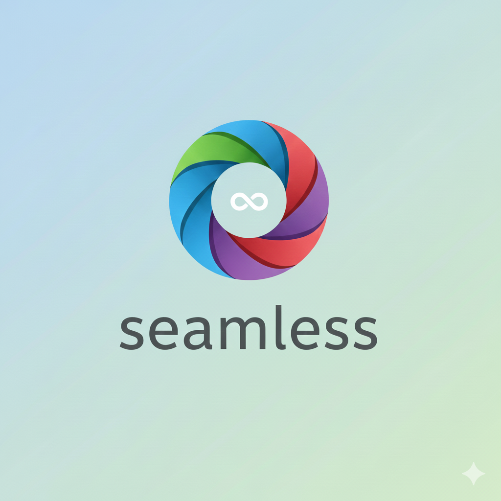

<p align="center">
  
</p>

# Seamless


Seamless is a straightforward, open-source file transfer utility designed to solve the common problem of sending files instantly between different operating systems on a local network.

It is built for users and developers who prefer a simple, cable-free alternative to moving files between mobile and desktop platforms.

---

## Downloads & Pre-built Releases

Pre-built application binaries are available for common platforms, allowing you to use Seamless without needing to clone the repository or run scripts:

* **Android:** Download the `.apk` file from the [Releases page](https://github.com/iman-zamani/seamless/releases).
* **macOS:** Download the pre-built application bundle from the [Releases page](https://github.com/iman-zamani/seamless/releases).
* **Windows / Linux:** Requires Python and manual setup (see "Getting Started" below).

---

## Key Features

* **Cross-Platform File Transfer:** Seamlessly share files between **Android, macOS, Windows, and Linux** using your local Wi-Fi network.
* **Zero-Configuration Discovery:** Devices automatically locate each other using UDP broadcasting on the local subnet. No manual IP configuration is required.
* **High-Speed Transfers:** Utilizes raw TCP sockets with optimized 64KB buffer sizes, ensuring stable and fast transfers limited only by your router speed.
* **Modern UI:** Features a native-feeling dark-mode GUI using `CustomTkinter` on desktop and Material Design on Android.

---

## Tech Stack

### Desktop (Windows / macOS / Linux)

| Component | Technology | Details |
| :--- | :--- | :--- |
| **Language** | Python 3.x | |
| **GUI Framework** | [CustomTkinter](https://github.com/TomSchimansky/CustomTkinter) | For a modern, dark-mode native look. |
| **Networking** | Native `socket` & `threading` | Used for asynchronous discovery and file streaming. |

### Mobile (Android)

| Component | Technology | Details |
| :--- | :--- | :--- |
| **Language** | Kotlin | Targeting Android 7.0 (Nougat) and higher. |
| **Concurrency** | Kotlin Coroutines (`Dispatchers.IO`) | For non-blocking network operations. |
| **Networking** | `java.net.Socket` / `DatagramPacket` | TCP for streaming, UDP for discovery. |

---

## Getting Started (For Developers)

### Prerequisites

* **Desktop:** Python 3.8 or higher.
* **Android:** Android 7.0 (Nougat) or higher.
* **Network:** Both devices must be connected to the **same local Wi-Fi network**.

### 1\. Running the Desktop Client

The desktop application is located in the root of the repository as `seamless.py`.

1.  **Clone the repository:**
    ```bash
    git clone https://github.com/iman-zamani/seamless.git
    cd seamless
    ```

2.  **Install dependencies (requires `customtkinter`):**
    ```bash
    pip install customtkinter
    ```

3.  **Run the application:**
    ```bash
    python seamless.py
    ```

### 2\. Running the Android App

1.  Open the `Android/` folder in **Android Studio**.
2.  Sync Gradle files, connect your device or start an emulator.
3.  Click **Run** in Android Studio.
4.  *Note: Ensure **Storage permissions** are granted upon the first launch on the Android device.*

---

## Usage Guide (Send & Receive)

The process is initiator-driven, requiring the receiver to be ready before the sender begins scanning.

### Sending Files (Sender's Steps)

1.  Open Seamless on both the sender and the receiver.
2.  The **Receiver** must click **"Receive Files"** first to start listening.
3.  On the **Sender**, click **"Send Files"** and select the file(s) you wish to transfer.
4.  Click **"Scan Network"** and wait for the receiver's name to appear.
5.  Select the **Receiver's name** from the list to begin the transfer.

### File Locations

| Platform | Default Save Location |
| :--- | :--- |
| **Desktop** | A newly created `received_files` folder in the application's root directory. |
| **Android** | The system's standard **Downloads** folder. |

---

## Troubleshooting

If devices fail to connect, check the following common issues:

* **Network Consistency:** Verify both devices are connected to the **exact same Wi-Fi SSID**. Ensure neither device is connected to a "Guest" network, as these often isolate clients.
* **VPN Interference:** Local network traffic is often bypassed by VPNs. Disable any active VPNs on both the sender and receiver.
* **Firewall:**
    * **Windows:** Allow `python.exe` and the Android app through your firewall for both Private and Public networks.
    * **macOS:** Check **System Settings > Privacy & Security > Local Network** and ensure your terminal/IDE has permission enabled.

---

##  Protocol Details 

Seamless uses a simple, raw protocol built on standard socket primitives:

* **Discovery Protocol:** UDP broadcast on port `5000`.
    * Listening devices bind to `0.0.0.0:5000`.
    * Broadcasting device sends `HERE:Username` to the subnet broadcast address (e.g., `192.168.1.255`).
* **Transfer Protocol:** Raw TCP socket on port `5001`.
    * **Header Format:** `filename<SEPARATOR>filesize\n`
    * **Body:** The raw binary data of the file is streamed immediately following the header, in 64KB chunks.

---

## License

This project is licensed under the **GPL (General Public License)**. See the `LICENSE` file in the repository for full details.
